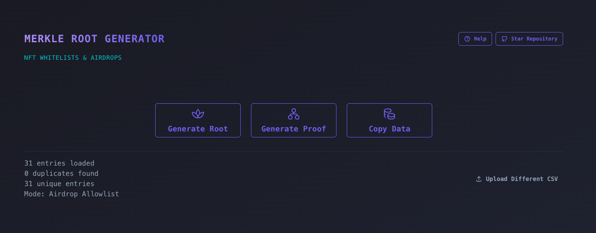

# Merkle Root Generator

<p align="center">
  
</p>

A secure and efficient tool for generating Merkle roots from NFT allowlist CSV files. This application helps ensure the integrity of NFT sales and auctions by creating cryptographic proofs that prevent tampering with allowlists.

## What is a Merkle Root?

A Merkle root is a cryptographic hash that serves as a digital fingerprint for a set of data. In the context of NFT allowlists, it's a single hash value that represents the entire list of eligible wallet addresses. This creates an immutable reference point that can be used to verify address inclusion without storing the entire list on-chain.

## Why Use Merkle Roots for NFT Allowlists?

### The Problem
Traditional allowlist management has several security vulnerabilities:

- **Tampering Risk**: CSV files can be easily modified, allowing unauthorized addresses to be added or legitimate ones removed
- **Centralization**: Storing full allowlists on-chain is expensive and inefficient
- **Transparency Issues**: Participants can't easily verify their inclusion without revealing the entire list

### The Solution
Merkle roots provide a secure, efficient, and transparent solution:

- **Immutability**: Once generated, the Merkle root cannot be altered without detection
- **Cost Efficiency**: Only the root hash needs to be stored on-chain
- **Privacy**: Individual proofs can be generated without revealing the full allowlist
- **Verifiability**: Anyone can prove their inclusion using a cryptographic proof

## How It Works

1. **Input**: Upload a CSV file containing wallet addresses
2. **Validation**: The system validates all addresses and prompts for corrections if needed
3. **Generation**: A Merkle tree is constructed and the root hash is computed
4. **Output**: You receive the Merkle root and the processed address array

## Usage

### Prerequisites
- A CSV file containing wallet addresses (one per line)
- Valid Ethereum-style addresses (0x followed by 40 hexadecimal characters)

### Steps
1. **Prepare Your CSV**: Ensure your file contains only valid wallet addresses
2. **Upload**: Select your CSV file using the file picker
3. **Validate**: The system will check all addresses and highlight any issues
4. **Generate**: Once validation passes, the Merkle root will be generated
5. **Copy**: Use the provided copy buttons to get the Merkle root and address array

### Smart Contract Integration

Once you have your Merkle root, you can integrate it into your smart contract:

```solidity
// Example usage in a smart contract
mapping(bytes32 => bool) public merkleRoots;

function setMerkleRoot(bytes32 _merkleRoot) external onlyOwner {
    merkleRoots[_merkleRoot] = true;
}

function verifyAllowlist(
    bytes32[] calldata _proof,
    address _address,
    bytes32 _merkleRoot
) public view returns (bool) {
    bytes32 leaf = keccak256(abi.encodePacked(_address));
    bytes32 computedHash = leaf;
    
    for (uint256 i = 0; i < _proof.length; i++) {
        bytes32 proofElement = _proof[i];
        
        if (computedHash <= proofElement) {
            computedHash = keccak256(abi.encodePacked(computedHash, proofElement));
        } else {
            computedHash = keccak256(abi.encodePacked(proofElement, computedHash));
        }
    }
    
    return computedHash == _merkleRoot;
}
```

## Security Features

- **Address Validation**: Ensures all addresses are properly formatted
- **Immutable Generation**: Once created, the Merkle root cannot be modified
- **Cryptographic Security**: Uses industry-standard hashing algorithms
- **Proof Generation**: Enables efficient verification without revealing the full list

## Contributing

Contributions are welcome! Please feel free to submit a Pull Request.

## License

This project is licensed under the MIT License - see the LICENSE file for details.
